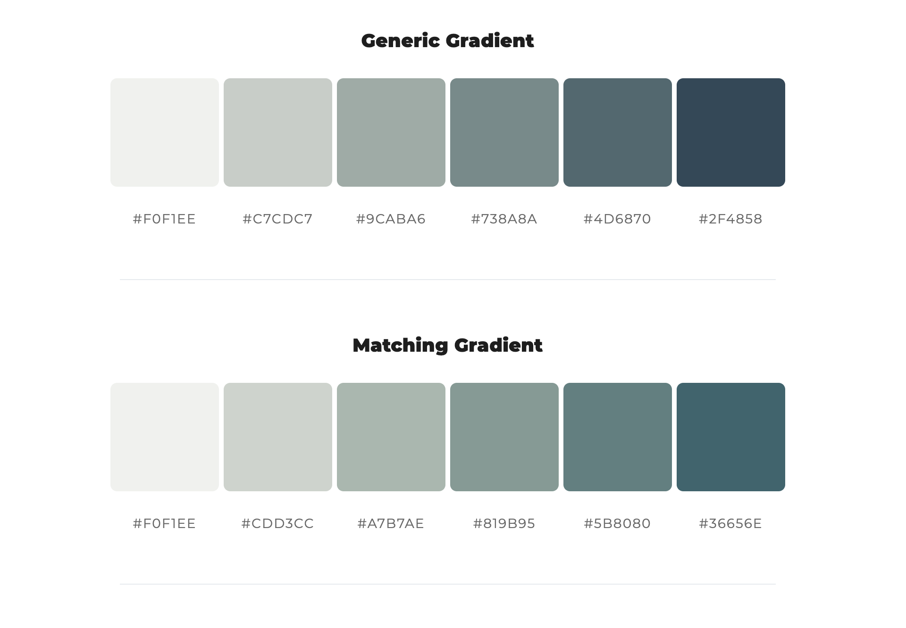

# fantasy-hero
Welcome to Fantasy Hero; an interactive web app that lets you create your own custom character.  

Let your imagination flow into another world as your hero becomes updated with it's most recent skills, weapons, allies and accomplishments, to name a few.   

Or, gain the status of ruler in your game as your kill off and delete your enemies to keep track of everyone's placement.   

Try it out for yourself or check out our heroes that we have made in the past!

## MVP

MVP consists of creating a working product that allows users to create their own custom characters, view existing characters on a page, and update/remove their characters. 

### Deployment
- Front end React app will be deployed via [Surge](https://surge.sh/)
- Backend will be deployed via [Heroku](heroku.com)
- MongoDB database will be deployed to [MongoDB Atlas](https://www.mongodb.com/cloud/atlas)

### CRUD Functionality
- Creating custom characters
- Reading characters from database, displaying them on page
-  Updating character details and abilities
-  Deleting characters

### Tools
- CSS Flexbox/Grid
- Google Fonts
- MERN stack (MongoDB, Express, React, Node)
- React Routes
- React Components
- Color Pallete Generated by [ColorSpace](https://mycolor.space/)
-  *Git commits are to be made regularly by team members on their respective branchs and must be approved before merging.*


### POST MVP
 - Search Functionality
 - Images
 - Transformation into turn based battle game based on randomized HP & Attack values
 

### Wireframes/UI/System Design
#### Wireframes by Figma:

[**Click here for Figma's verison of the wireframe**](https://www.figma.com/file/IIfkCijDDmBuGX6P8A6SBS/fantasy-hero?node-id=0%3A1)

#### UI


Primary/Secondary Fonts Choice: Google Fonts (Montserrat/Open Sans)
Colors:



#### Stack
```
System Overview/Stack:
MongoDB
Express
React
Node.js
```

#### Folders
```
|__ public
  |__ wireframes
  |__ login-images
```
```
|__ assets
  |__ styles
    |__ css
  |__ tests(not mvp)
```

#### React/Express 

```
Front-End Setup:
|__ client
  |__ src/
    |__ components/
      |__ Shared/
        |__ Footer.jsx
        |__ HeroForm.jsx
        |__ Layout.jsx
    =>Sort.js? helpers?
    |__ routes/
        |__ AuthenticatedRoutes.jsx
        |__ index.js
    |__ screens/
        |__ Landing.jsx
        |__ Header.jsx
        |__ Heros.jsx
        |__ HeroCreate.jsx
        |__ HeroEdit.jsx
        |__ SingleHeroView.jsx
        |__ SignUp.jsx
        |__ SignIn.jsx
        |__ ChangePassword.jsx
    |__ services/
        |__ apiConfig.jsx
        |__ auth.js
        |__ heros.js //apicrud
    |__ App.jsx
    =>RandomizeText.js? //helpers?
```
```
|__ routes/
  |__ index.js/

```
#### MongoDB/JWT/Authentication
```
Backend Setup: 
|__ controllers/
  |__ index.js/
```
```
|__ helpers/ 
  |__ index.js/
```
```
|__ db/
  |__ index.js/
```
```
|__ models
  |__ Account.js?
    |__username: string
    |__password: string
  |__ Class.js
    |__class: string
        [(
          skill a
          skill b
          skill c
          ultimate
        )]
  |__ Hero.js
    |__name: string
    |__class: [objectID]
    |__race: string
    |__hp: int
    |__atk: int
    |__weapon: string
    |__img: string 
```
```
  |__ seed
    |__ Accounts.js
    |__ Classes.js
    |__ Heros.js
```